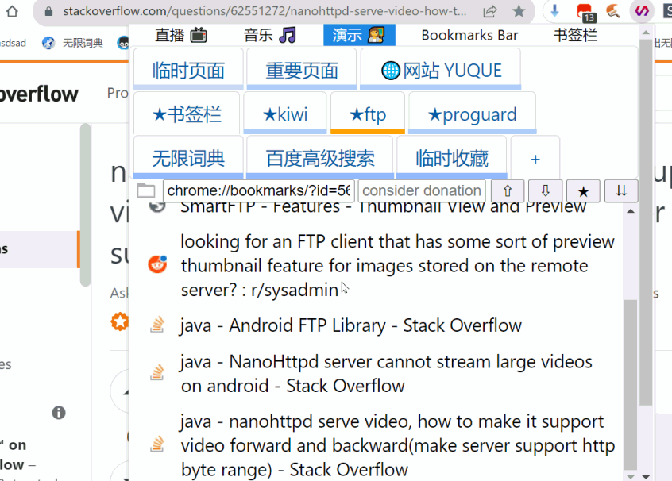
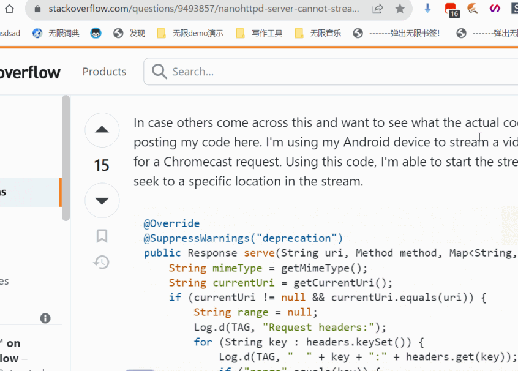
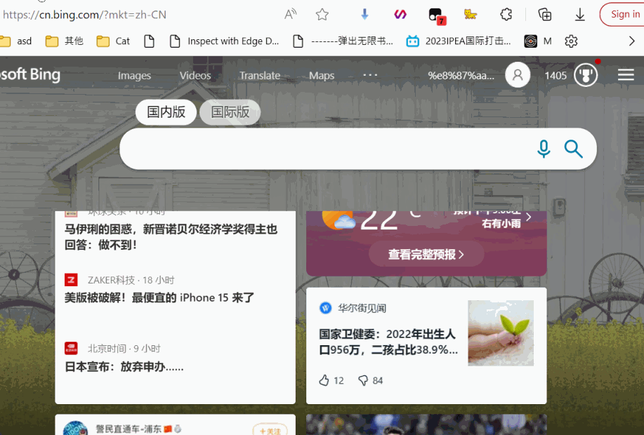

[homepage](https://knifer.github.io/#/content/%E6%97%A0%E9%99%90%E4%B9%A6%E7%AD%BE_devlog)

## basic functions 

insert bookmark separator:

  

find out current bookmark's folder and position by right-click on the star button:

  

you can create, edit, and manage bookmarks in the popup window.

the listview's scroll position will be restored next time you open the window.

## Add Link To Temporary Urls

https://github.com/KnIfER/chrome-InfiniteBookmarkExtensions/assets/11593903/f01bef37-ff60-4b99-9ee9-11c8aafef9a6

you can then visit those links later. 'delete on click' is default

## Create and use new search engine

https://github.com/KnIfER/chrome-InfiniteBookmarkExtensions/assets/11593903/72d0e68e-7309-43e9-95a3-00252b103946

The second input will undertake keywords in url and text selection for current page. 

## Quick switch between search engine

https://github.com/KnIfER/chrome-InfiniteBookmarkExtensions/assets/11593903/340c0687-a196-43b9-8862-7712039f5d4b

